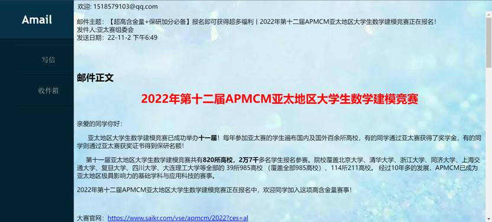

# Amail

一个基于POP3和SMTP协议的邮件收发系统。

## 项目架构

该项目采用前端三件套（html&css&javascript）实现web端界面，后端采用controller和service两层架构，其中service通过javamail包所实现的SMTP与POP3协议执行具体的收发邮件功能

## 运行界面

### 登录界面

登录界面的主要目的是为了获取用户的POP3服务器，用户名以及对应的发件人密码，在本例中依次是：pop.qq.com，我的邮箱账号以及邮箱授权码。其中，服务器的地址可以直接通过解析用户名@后缀获得，故不需要用户自己填写。登陆界面如下：

图1：登陆界面

### 收件箱

登录成功后，系统会通过用户的主机名，邮箱以及密码自动获取邮箱列表，并显示在如下所示的收件箱中：

图2：收件箱

### 查看邮件

点击右侧的查看邮件，可以看到邮件的详细信息。通过浏览器端的HTML解析，我们可以轻松地解析出原作者要展示的内容，解决了格式混乱、乱码的问题。如下面两张图所示：

图3：邮件详情

图4 邮件详情

### 写邮件

同时，点击界面左侧的写信，我们还可以直接写信。在写邮件的界面中，我们可以选择邮件的收件人、主题，抄送人以及发送的附件。

并且，我们实现的写邮件的功能支持插入图片，以及基本的HTML格式（加粗、斜体、下划线等）。如下图所示：

图5：写信界面

### 发送邮件

写好邮件后，只需点击发送按钮，即可发送邮件，并跳转的如下所示的窗口：

图6：发送邮件

收件人收到的邮件如图：

图7：接收人的界面

我们也可以使用本邮箱系统进行检查：

图8：收到的本系统发送的邮件

### 下载附件

同时，下图是系统下载附件的功能：

图9：下载附件

图10：下载附件成果

